# Git and GitHub

## Git

Git is a free and open source distributed version control system designed to handle everything from small to very large projects with speed and efficiency.

### Installation on Windows

This section will guide you through the installation process of the Git command line tool for Windows.

#### Downloading Git

Navigate to [git-scm.com](https://git-scm.com) and click the **Download for Windows** link. The download process should start automatically.


If your download doesn't start automatically, just click the `64-bit Git for Windows Setup` link.

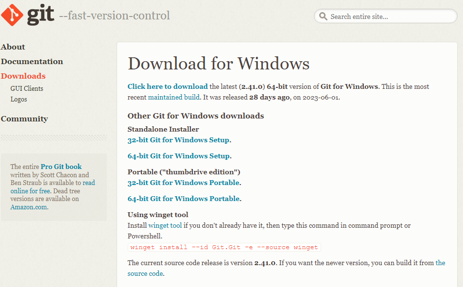

#### Installation Wizard

Start the wizard by executing the installer and follow the steps of the installation wizard.

When presented with the **Windows User Account Control** popup you can select `Yes` to continue.

Click `Next` to accept the GNU license.

You can keep the default destination location `C:\Program Files\Git`. Click `Next` to continue.

When presented with the components selection screen, **unselect** the `Windows Explorer Integration` component.

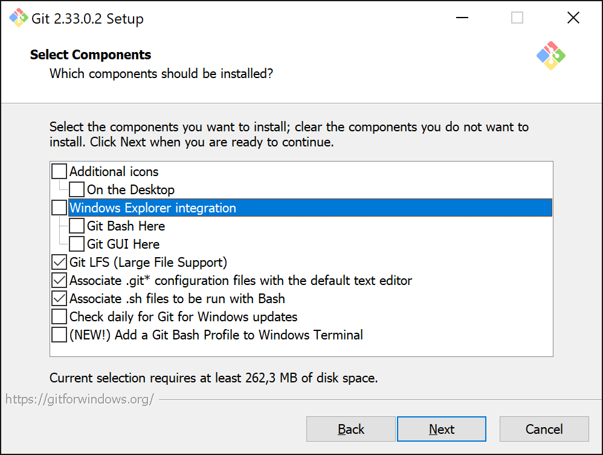

Keep the start menu folder to its default setting.

Next you will need to select the default text editor to be used with Git.

If you already have Visual Code installed, you can select the option `Use Visual Studio Code as Git's default editor`. If not, then leave the default which is `Use Vim (the ubiquitous text editor) as Git's default editor`.

::: warning 🔥primary branch
Some time ago git changed the name of the primary branch from `master` to `main`. This installation step will allow you to decide what name you wish to give your primary branch. Since all our courses are not yet updated to the new system, we prefer to keep it at `master` for the time being.
:::

Next you will need to decide what tools are installed and added to your PATH. Select the option `Use Git and optional Unix tools from the Command Prompt`. This will allow us to use some useful unix tools from PowerShell.

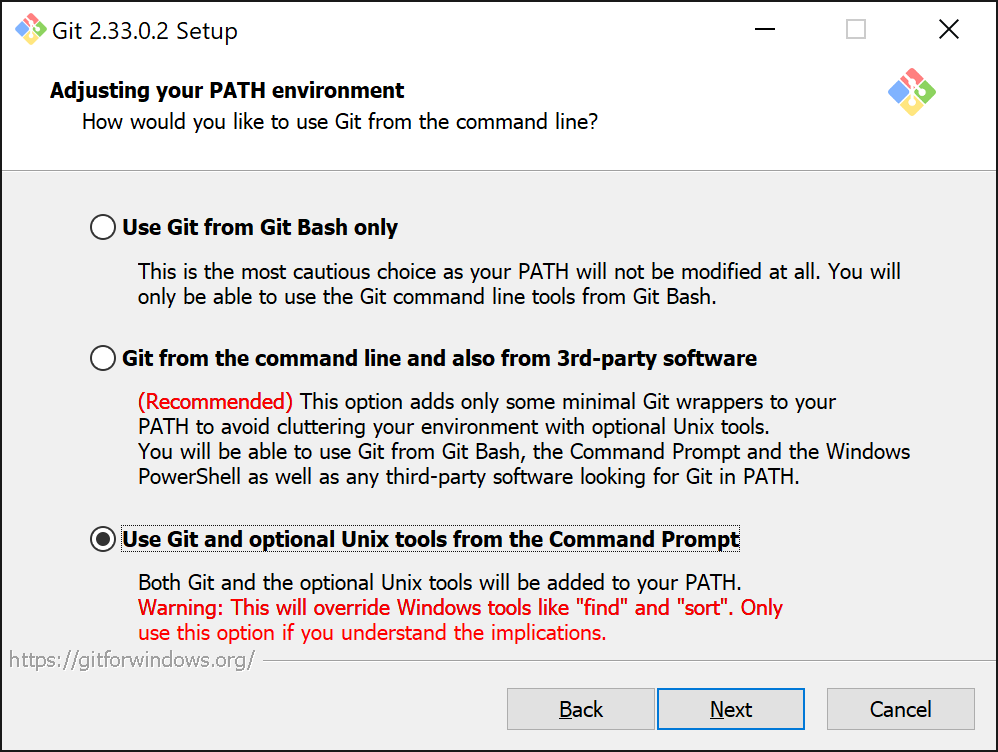

The following screen allows us to select the SSH client that Git will use. Leave the default option, which is `Use OpenSSH`.

Next you will need to select which SSL/TLS library needs to be used for HTTPS connections. Leave the default option, which is `Use the OpenSSL library`.

Now Git needs to know how it should treat line-endings when committing files. This because line-endings differ between Windows and Linux. Leave the configuration of line encoding conversion to its default, which is `Checkout Windows-style, commit Unix-style line endings`.

Next the Terminal Emulator can be selected. Leave the default `Use MinTTY (the default terminal of MSYS2)`.

Now the default behavior of `git pull` can be configured. Leave the default `Default (fast-forward or merge)`.

Leave the credential helper set to its new default `Git Credential Manager Core`.

Leave the default extra features as is.

Don't include experimental options.

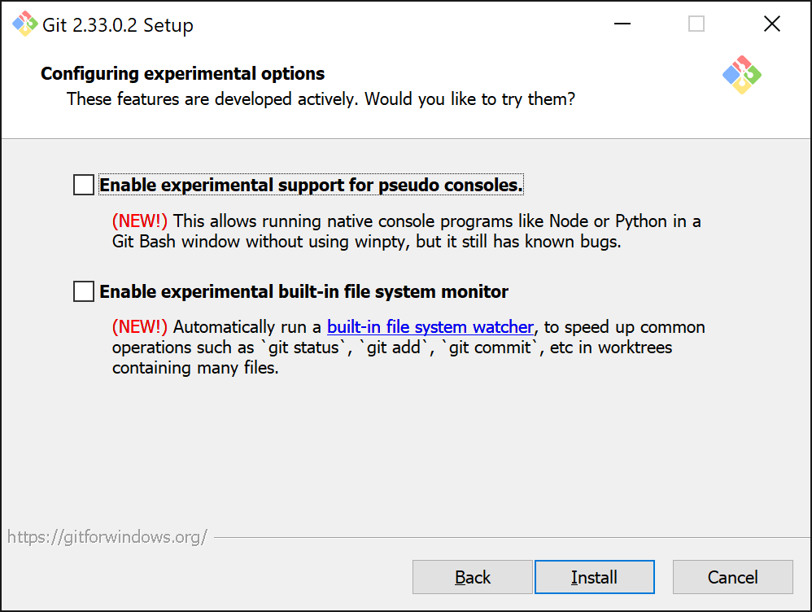

Once `Install` is clicked, the installation wizard will start with the installation of Git and the different tools.

When the installation procedure is finished, you can close the installation wizard by clicking `Next`.

#### Testing installation

In the Windows start menu, search for the "Powershell" application by typing "Powershell" in the search box.

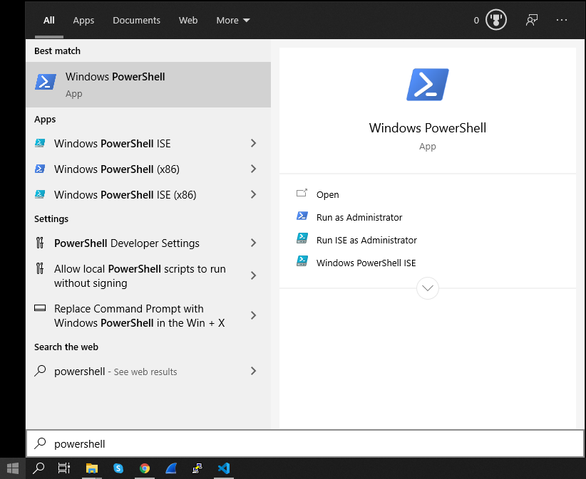

To test if Git was successfully installed, enter the following command in the powershell console:

```bash
git --version
```

If all goes well, it should tell you the current version of the installed Git client, and should not show any errors.

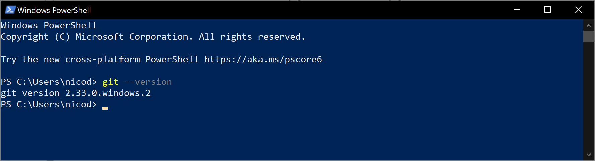

Git is now ready to be used.

### Installation on Linux

Many linux distributions these days have Git pre-installed. If not, or its an older version, then just open up a terminal window and install/update Git using `apt`:

```bash
sudo apt update
sudo apt install git
```

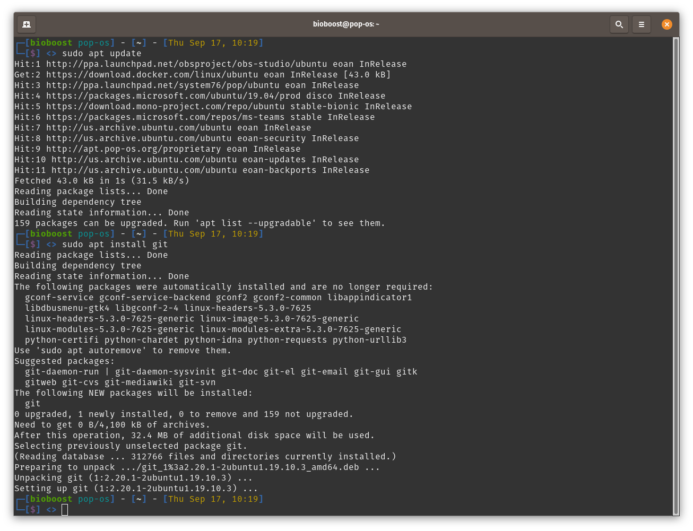

Test your installation using:

```bash
git --version
```

If all goes well, it should tell you the current version of the installed Git client, and should not show any errors.

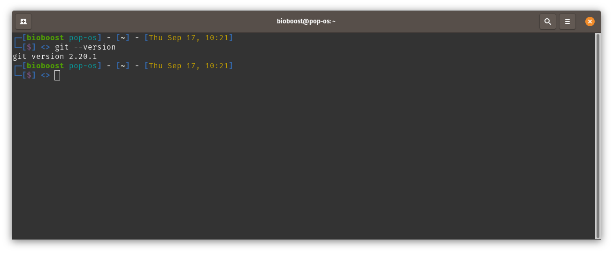

Git is now ready to be used.

### Configuration

Git needs some minor configuration before it can really be used. Basically Git needs some personal information about you so it knows who is doing all the work.

#### Name and email

Before you start using Git, you need to configure your name and email address.

You can do this with the following two commands:

```bash
git config --global user.name "John Doe"
```

and

```bash
git config --global user.email johndoe@example.com
```

Please make sure to change `John Doe` to your own name, and change `johndoe@example.com` to your own email address.

You should use your **personal email address** instead of you school email address. This way the history you make in Git is always credited to you, even if you finish your education.

## Posh-git

Posh-git is a PowerShell module that integrates Git and PowerShell by providing Git status summary information that
can be displayed in the PowerShell prompt, e.g.:

```powershell
C:\Users\Keith\GitHub\posh-git [master ≡ +0 ~1 -0 !]>
```

Posh-git also provides tab completion support for common git commands, branch names, paths and more.
For example, with posh-git, PowerShell can tab complete git commands like `checkout` by typing `git ch` and pressing
the <kbd>tab</kbd> key. That will tab complete to `git checkout` and if you keep pressing <kbd>tab</kbd>, it will
cycle through other command matches such as `cherry` and `cherry-pick`. You can also tab complete remote names and
branch names e.g.: `git pull or<tab> ma<tab>` tab completes to `git pull origin master`.

More information can be found at [https://github.com/dahlbyk/posh-git](https://github.com/dahlbyk/posh-git)

### Installation

Installing posh-git can be a bit daunting. Just make sure to read the instructions carefully.

#### Prerequisites

Open an elevated PowerShell window by searching for `PowerShell` in the start menu, right clicking the `Windows PowerShell` item and selecting `Run as Administrator` as shown the next screenshot.


Before installing posh-git make sure the following prerequisites have been met.

1. Windows PowerShell 5.x or PowerShell Core 6.0.
   Check your PowerShell version by executing `$PSVersionTable.PSVersion`.

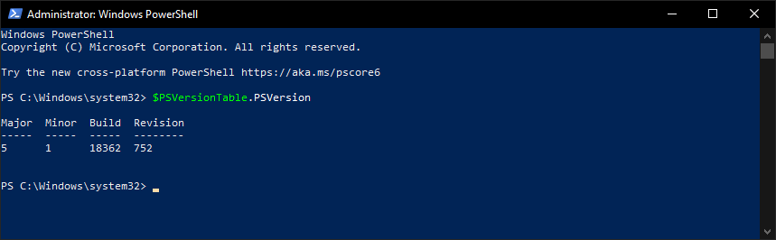

2. On Windows, script execution policy must be set to either `RemoteSigned` or `Unrestricted`. This can be configured by executing the following command and allowing both policies by selecting `Yes`:

```powershell
Set-ExecutionPolicy RemoteSigned -Scope CurrentUser -Confirm
```

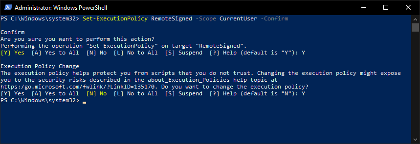

3. Git must be installed and available via the PATH environment variable.
   Check that `git` is accessible from PowerShell by executing `git --version` from PowerShell.

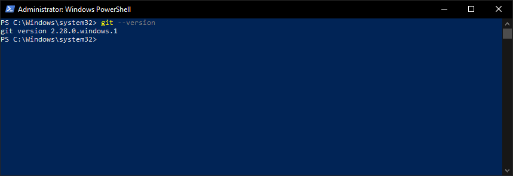

If all pre-requisites have been met, you are ready to install posh-git.

#### Installing posh-git via PowerShellGet

Execute the command below to install posh-git from the [PowerShell Gallery](https://www.powershellgallery.com/):

```powershell
PowerShellGet\Install-Module posh-git -Scope CurrentUser -Force
```

You may be asked to install the NuGet package manager before continueing. Answer `Yes` to allow installation of this module to proceed.

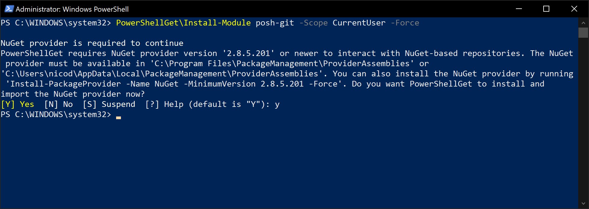

If you don't get asked to install NuGet but get an error instead, then use the following commands to install NuGet first and then try installing again with the command above.

```powershell
Install-PackageProvider NuGet -Force
Import-PackageProvider NuGet -Force
```

Now you can update posh-git to the lastest version with:

```powershell
Update-Module posh-git
```

### Using posh-git

After you have installed posh-git, you need to configure your PowerShell session to use the posh-git module.

This can be easily achieved by issueing the command:

```powershell
Add-PoshGitToProfile -AllHosts 
```

:::tip Note
Only use the `-AllHosts` option if you want posh-git to be added to all commandline hosts
:::

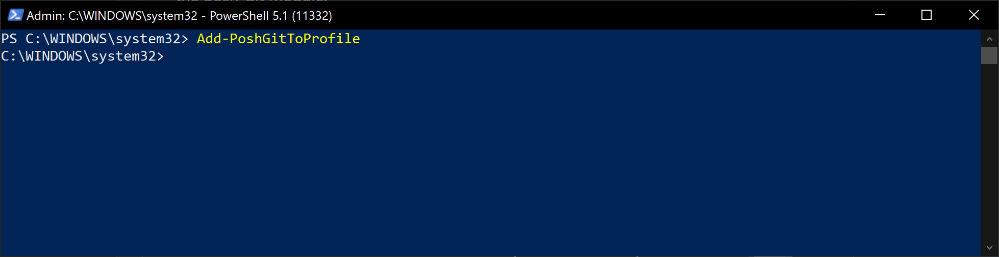

You can now close the elevated PowerShell window.

### Testing installation

Start by opening a new File Explorer and navigating to a location where you can create a test project. For example your documents or desktop.

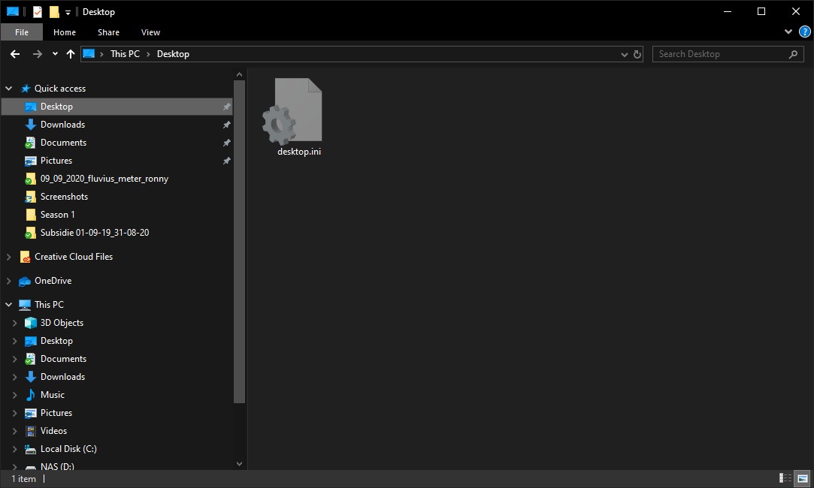

Now open a PowerShell window in that location by selecting `Open Windows PowerShell` from the file menu in the upper left corner of the `File Explorer` app.

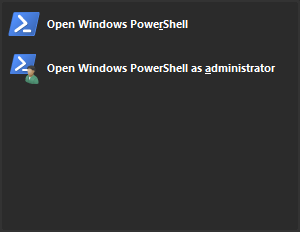

::: tip
You can also open a PowerShell window in any directory by holding down shift while right-clicking on a directory. Then choose the option `Open PowerShell window here`.
:::

Create a directory and initialize a git test repository with the following commands:

```PowerShell
mkdir hello_git
cd hello_git
git init
```

Now if you execute a `git status` you should see some posh-git magic as shown below:

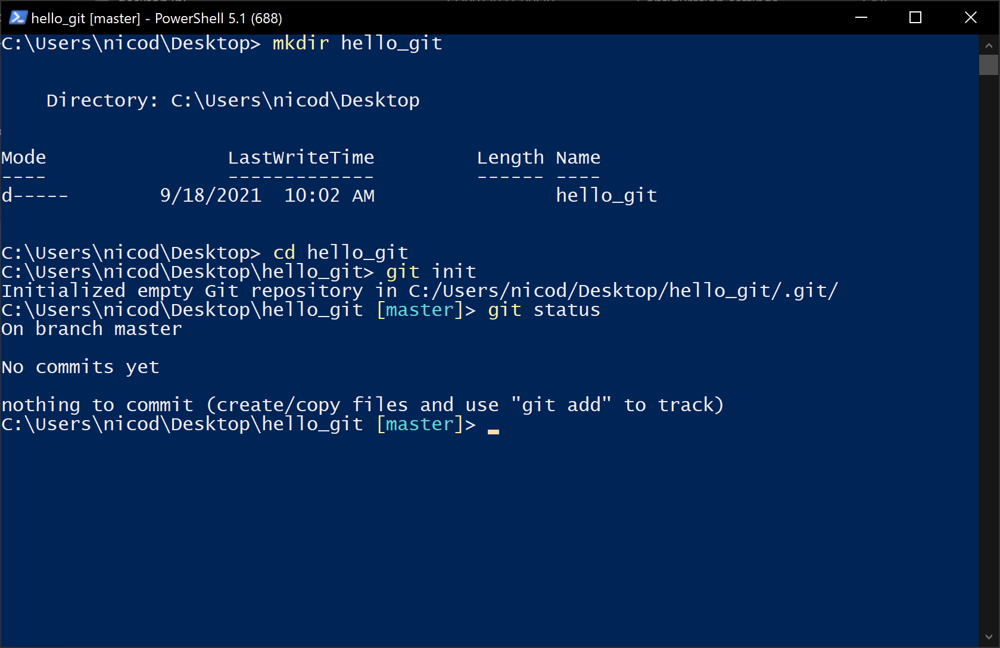

You are all good to go now.

## GitHub

GitHub is a web-based hosting service for version control using Git. It is mostly used for computer code. It offers all of the distributed version control and source code management (SCM) functionality of Git as well as adding its own features. It provides access control and several collaboration features such as bug tracking, feature requests, task management, and wikis for every project.

You can find GitHub on their website [github.com](https://github.com)

We choose GitHub because it is a great product. On the other hand it enables you as a student to build up a 'code portfolio' that you can be used when searching for a job, or internship. It should become something you are proud of and want to show of with.

### Create an account

Your GitHub account will extend beyond your student career, keep in mind it might become an account for life.

Traverse to [github.com/](https://github.com/) and click the `Sign up` button at the top right.

When creating an account, keep the following things in mind:

* **username**: You can choose your own username, no rules, keep in mind you might hold on to this account for many years.
* **email**: You can use your own personal email address (later on we will add your school email as well to get a free discount).
* **password**: Choose your password wisely, and never ever share it with anybody.

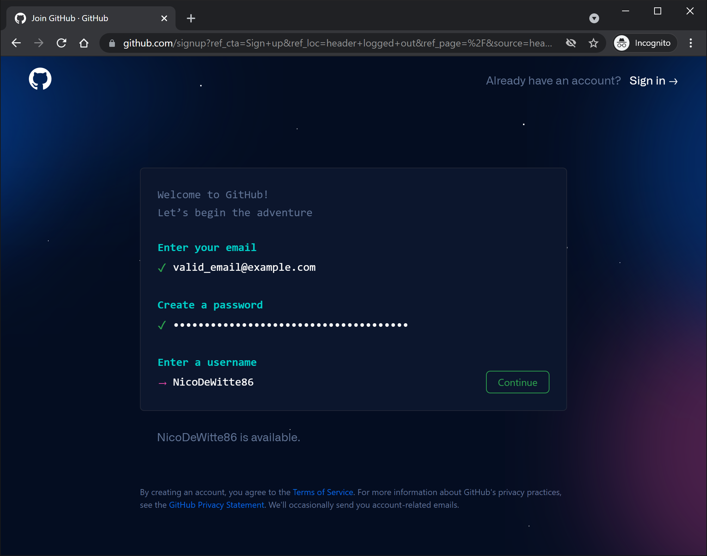

Next you will need to prove you are human.

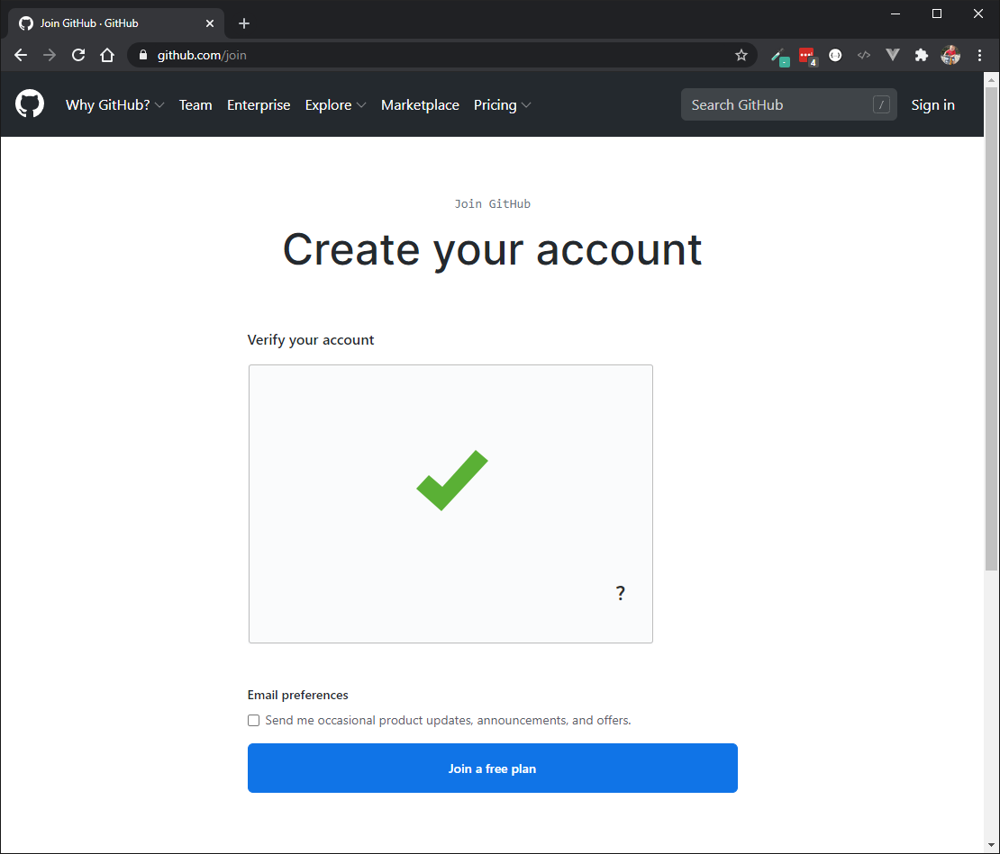

Next you will need to provide some details on how you plan to use GitHub. Just select the student-related options.

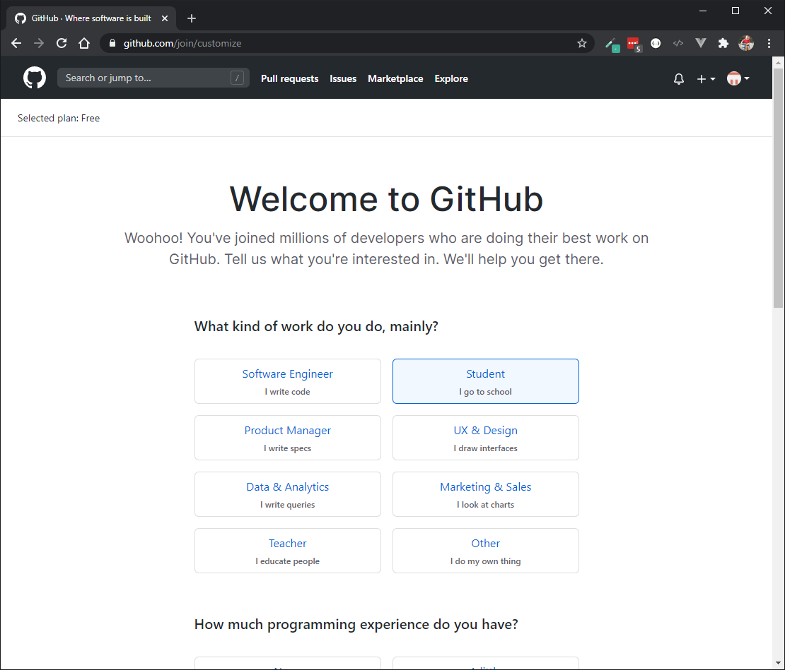

Next check your email to verify your account by clicking the `Verify email address` button.

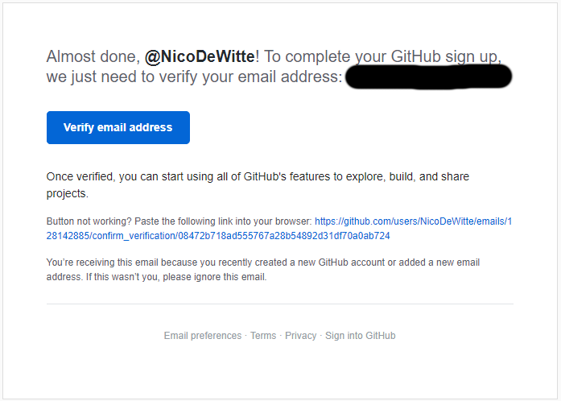

You will be redirected to your GitHub account. When presented with the screen with what to do first, just select `Skip this for now`.

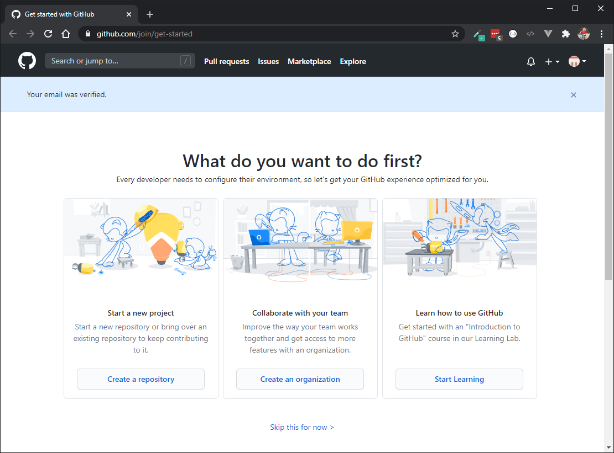

#### GitHub Education

As a VIVES student, you are entitled to a discount. To create private code repositories you need a paid plan. The GitHub Education program will give you the paid plan options for free as long as you are a VIVES student. This will enable all the bells and whistles, even unlimited private repositories.

##### Adding your VIVES email to your account

To prove GitHub you are a VIVES student, you need to add a second email to your (personal) GitHub account. Go to [github.com](https://github.com) and click on your profile picture in the upper-right corner.

Then click on **Settings**. On the left in the sidebar, an option **Emails** should be available. Click on it.

In "Add email address", type your email address and click **Add**.

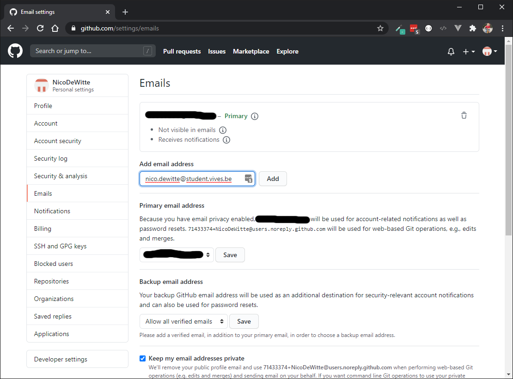

Next you should receive a verification email in your mailbox. Click on the link in that email to verify your email address.

##### Applying for the Educational discount

To get the educational discount navigate to dashboard by clicking the Octocat avatar in the top-left corner or by surfing to [github.com](https://github.com).

You dashboard should show an option `Get the Student Developer Pack`.


::: tip
If you do not get the option on your dashboard, you can also navigate to [https://education.github.com/](https://education.github.com/)and select the `Github Student Developer Pack`.
:::

Next select the option `Get your pack`.

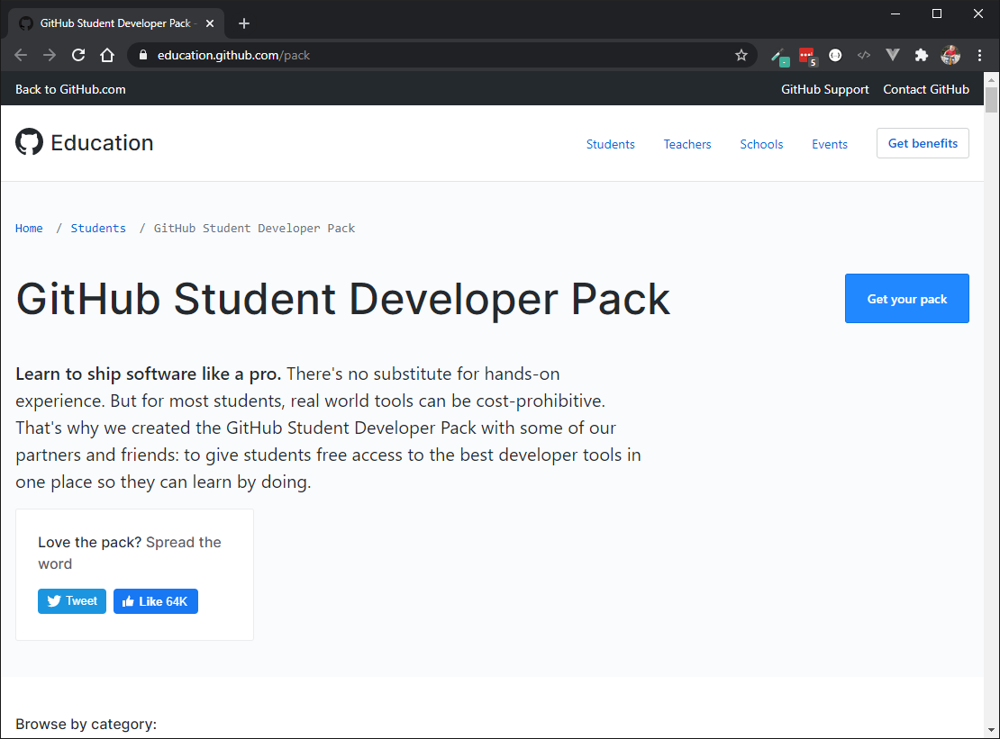

You will be presented with a form consisting of a few questions. Fill them in and make sure to select your VIVES student email address. Click the `Submit your information` button once you are finished providing the necessary information.

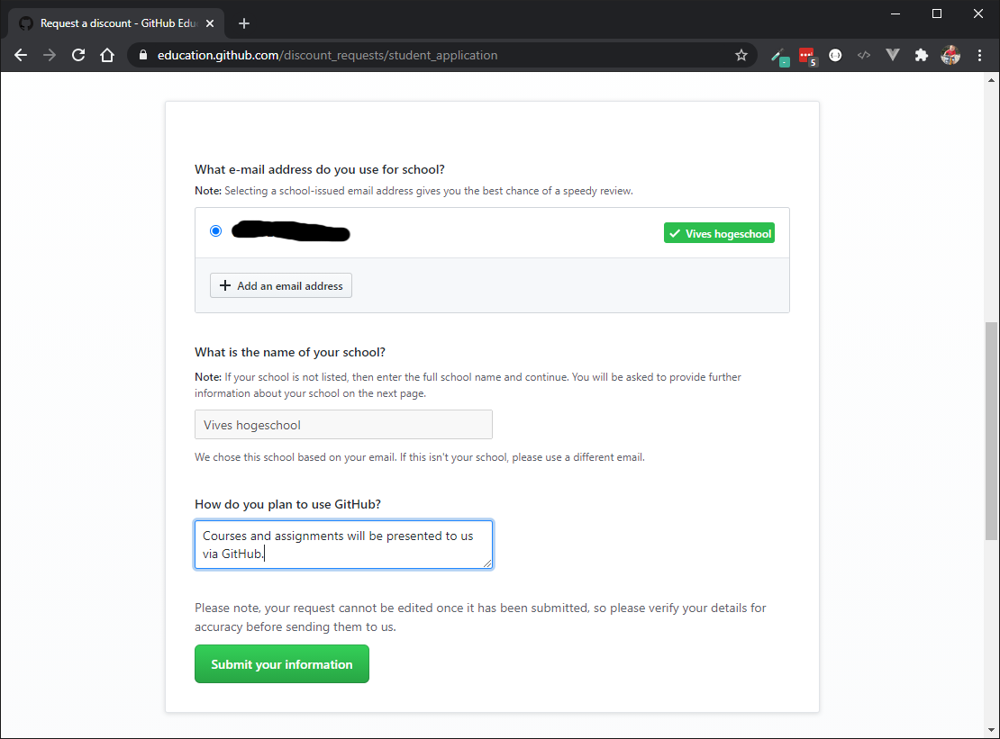

When all went well your application should be submitted and you should receive an email when your account has been allowed for the educational program.

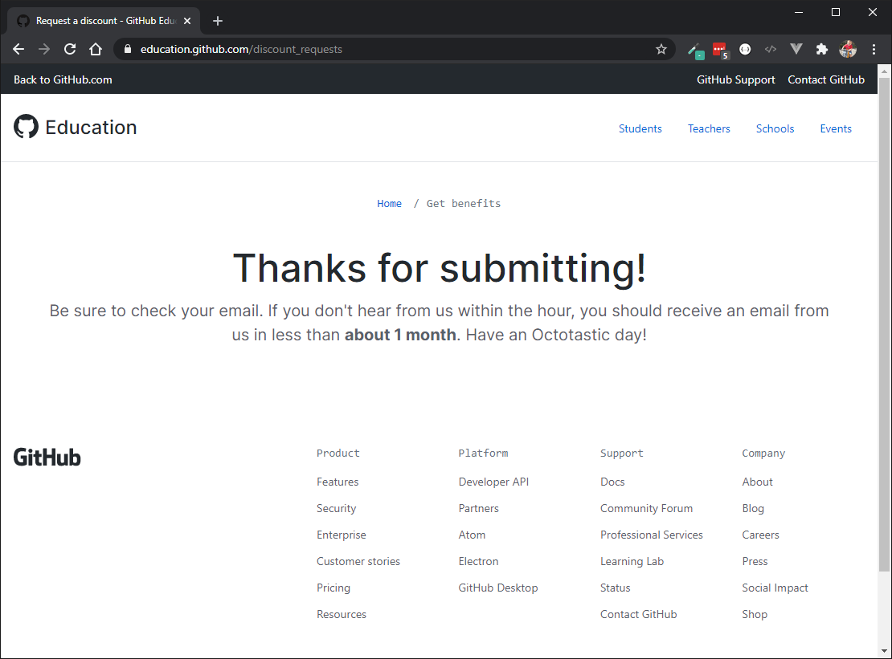

It may take some time to get verification of your discount.

### Public key authentication

When interacting with GitHub you have the option to enter your username and password every time. Because these interactions add up over time, entering a username and password will take a lot of your precious time.

A better solution is to make use of *public key authentication* (PKA). This way you don't need to provide your username and password with every interaction. PK authentication has more benefits over password authentication. For example it inherently makes use of encryption and is far more difficult to hack.

#### Generating a private and public key

First we need to generate a **private** and **public key** pair.

The **private key is a personal key** that needs to stored on the machine you want to use to interact with GitHub. This key is private and **should never be shared with anyone**. Sharing this key is the same as sharing your password.

The public key can be known by everyone. So it safe to store the key on GitHub.

Generating a random key-pair can be done with the `ssh-keygen` command. The command needs two extra options.

* `-t`: the type of the key, `rsa` in our case
* `-C`: Comment, add your name and machine name with the `@` notation. Eg: `sille@laptop`. **NOTE that the `C` option is a capital letter!**

Open up a PowerShell (or terminal in case of linux) and use the command below to generate a key-pair. Don't forget to replace the `yourname@machine` with your own comment.

```powershell
ssh-keygen -t rsa -C yourname@machine
```

The command will ask for some extra information. You should leave the default values by simply pressing `ENTER`. Keep the default installation path and do not use a password.

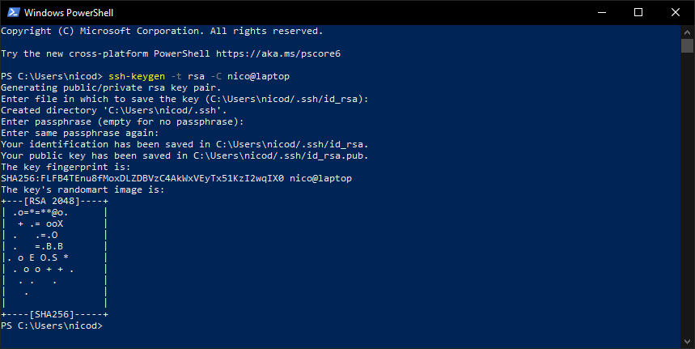

Both keys are placed in a subdirectory `.ssh` inside your Windows *user* directory (typically found in `C:\Users\<username>`)

* `id_rsa`: this file contains the private key, never share this
* `id_rsa.pub`: this file contains the public key

On linux these files can be found in your home directory below a directory called `.ssh`.

#### Adding your public key to your GitHub account

Copy the public SSH key to your clipboard (content of the `id_rsa.pub` file - you can use for example *Visual Code* to open the file).

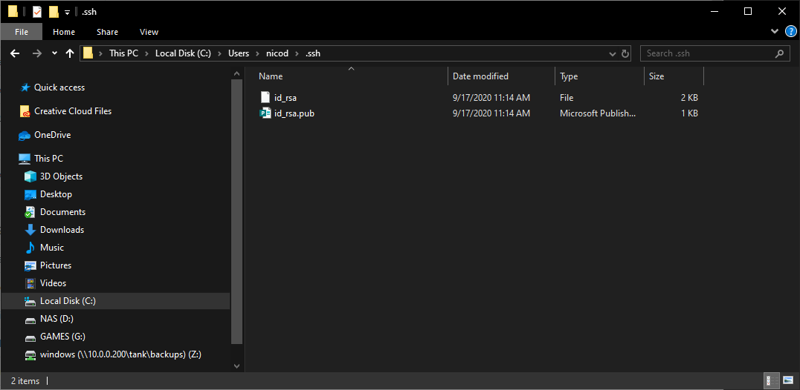

* In the upper-right corner of any page, click your profile photo and select **Settings**.
* In the user settings sidebar, click **SSH and GPG keys**.
* Click **New SSH key** or **Add SSH key**.
* In the `Title` field, add a descriptive label for the new key. For example, if you're using a personal laptop, you might call this key `Personal laptop`.
* Paste your key into the `Key` field.
* Click **Add SSH key**
* If prompted, confirm your GitHub password.

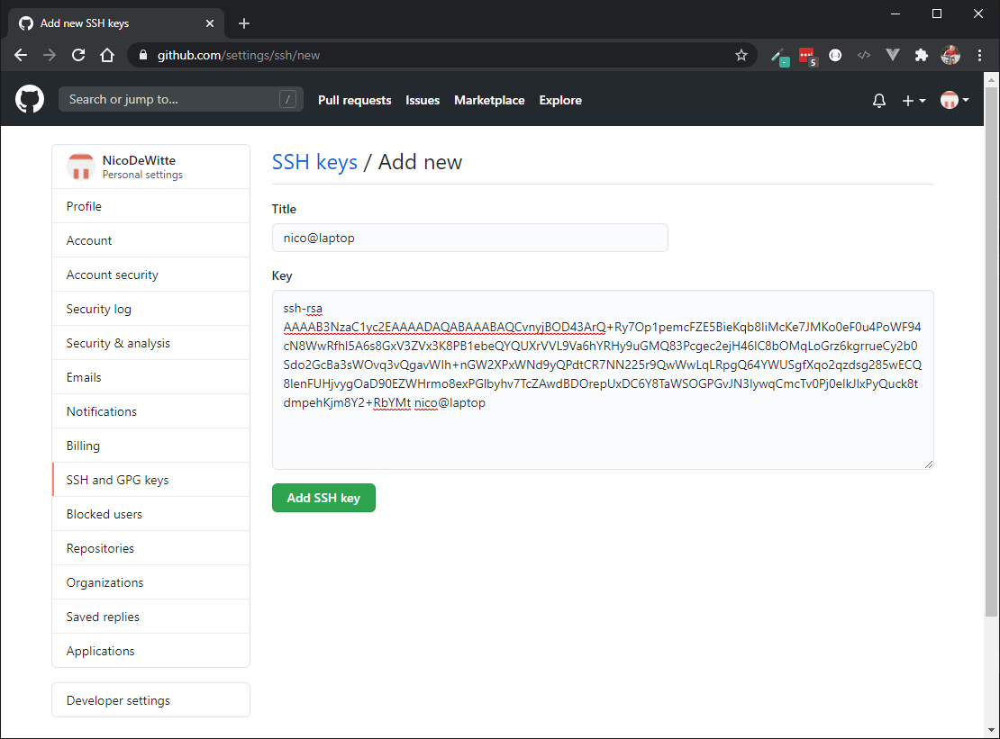

You are now ready to use GitHub without entering your username and password on every interaction.

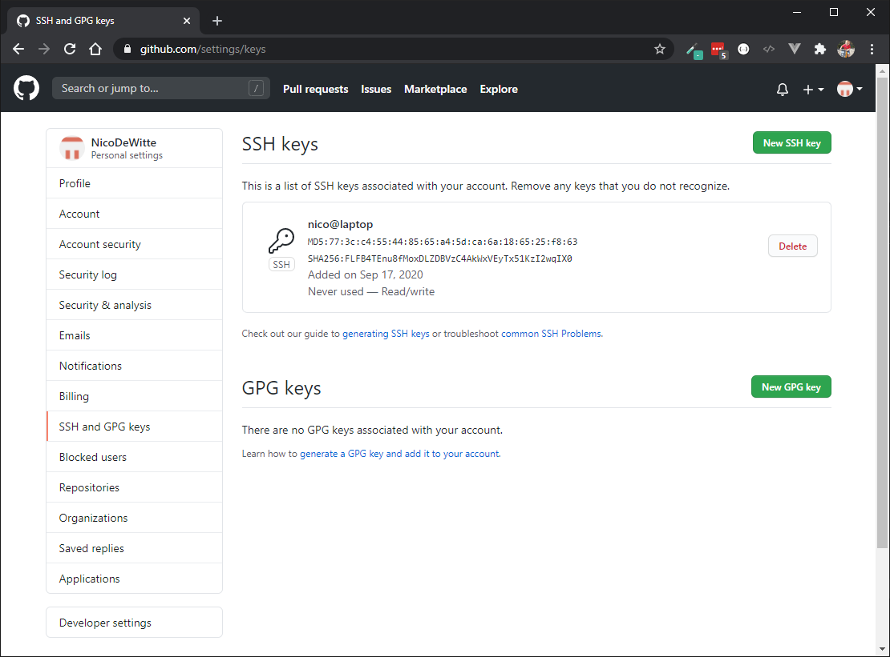