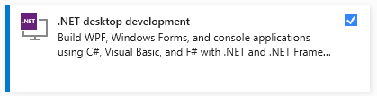
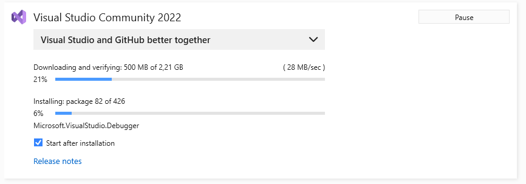
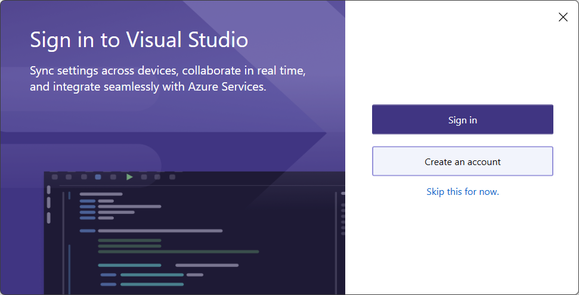

# Visual studio community

Microsoft Visual Studio is an integrated development environment (IDE) from Microsoft. It is used to develop computer programs, as well as websites, web apps, web services and mobile apps. Visual Studio uses Microsoft software development platforms such as Windows API, Windows Forms, Windows Presentation Foundation, Windows Store and Microsoft Silverlight. It can produce both native code and managed code.

Visual Studio is not to be confused with Microsoft Visual Code, which is a free generic source-code editor made by Microsoft for Windows, Linux and macOS.

## Installation

Follow the steps in this guide to install Visual Studio for C# development.

### Downloading the Installer

Google for `visual studio community` or navigate to [https://visualstudio.microsoft.com/vs/community/](https://visualstudio.microsoft.com/vs/community/).

Hit the `Download` button and wait for the installer to download.

### Installation Wizard

Run the executable, which should be called `VisualStudioSetup.exe`.

Click `Yes` if you get the `User Account Control` window.

Click **Continue** to install prerequisites and allow the actual installer to run.

Next you will need to select what components should be installed. Make sure to select the following:

- `.NET desktop development` (within the *Desktop & Mobile* section)

This will require about 8GB of space. You can change the installation location if you use a different drive for software installations. If not, leave it at its default location.

Click **Install** to begin the installation process.

The installation process will definitely take a while.

You can skip the sign in.

Now select a color theme and click **Start Visual Studio**.

Wait a minute for the setup to finish.

You are all set now.

## Troubleshooting

Known issues with Visual Studio Community:

xUnit Framework not Found

###   xUnit Framework not Found
If you get an error stating the the xUnit Framework cannot be found, you should check the NuGet package manager sources.

Traverse to `Tools => NuGet Package Manager => Package Manager Settings`. Next select the `Package Sources` entry as option (left side). It should contain the `nuget.org` package source as shown in the next screenshot:

If it does not exists, add it with the following settings:

* **Name:** `nuget.org`
* **Source:** `https://api.nuget.org/v3/index.json`

You may need to restart Visual Studio.

Attach button instead of Run

###   Attach button instead of Run

It may happen that when creating a new project or opening an existing project, you do not see any information in the solution explorer and the Run/Debug button has also been changed to an Attach button.

To resolve this you need to correct the environmental variables on your device.

Click on the windows key and start typing Edit the system variables and click on that option

Click on the Environment Variables button

Under the System variables, select Path and click the Edit button

Find the entry C:\Program Files\dotnet\dotnet.exe and using the Move up button, leave that entry before the x86 one. Here's my machine for example:

Click the OK button until all the windows are closed. Open a new command prompt and run `where dotnet`. This should bring the non x86 first and you should be able to use the SDK now.

