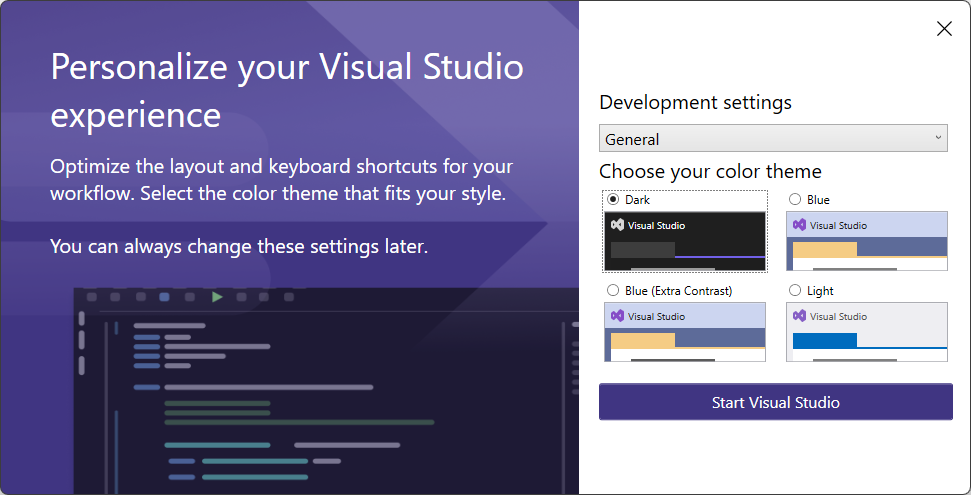

# Visual studio community

Microsoft Visual Studio is an integrated development environment (IDE) from Microsoft. It is used to develop computer programs, as well as websites, web apps, web services and mobile apps. Visual Studio uses Microsoft software development platforms such as Windows API, Windows Forms, Windows Presentation Foundation, Windows Store and Microsoft Silverlight. It can produce both native code and managed code.

Visual Studio is not to be confused with Microsoft Visual Code, which is a free generic source-code editor made by Microsoft for Windows, Linux and macOS.

## Installation

Follow the steps in this guide to install Visual Studio for C# development.

### Downloading the Installer

Google for `visual studio community` or navigate to [https://visualstudio.microsoft.com/vs/community/](https://visualstudio.microsoft.com/vs/community/).

Hit the `Download` button and wait for the installer to download.

### Installation Wizard

Run the executable, which should be called `VisualStudioSetup.exe`.

Click `Yes` if you get the `User Account Control` window.

Click **Continue** to install prerequisites and allow the actual installer to run.

Next you will need to select what components should be installed. Make sure to select the following:

- `.NET desktop development` (top left within the *Desktop & Mobile* section)
- `.NET Core cross-platform development` (bottom right in the *Other Toolsets* section)

This will require about 8GB of space. You can change the installation location if you use a different drive for software installations. If not, leave it at its default location.

Click **Install** to begin the installation process.

The installation process will definitely take a while.

You can skip the sign in.

Now select a color theme and click **Start Visual Studio**.

Wait a minute for the setup to finish.

You are all set now.

