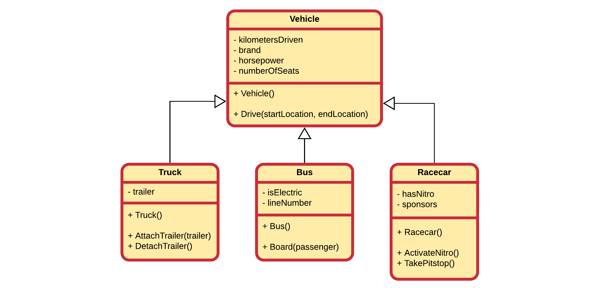
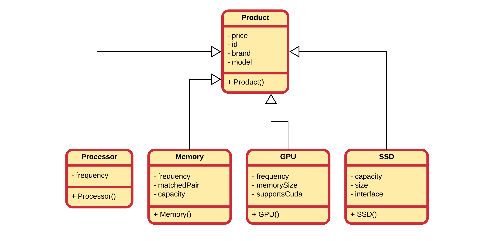
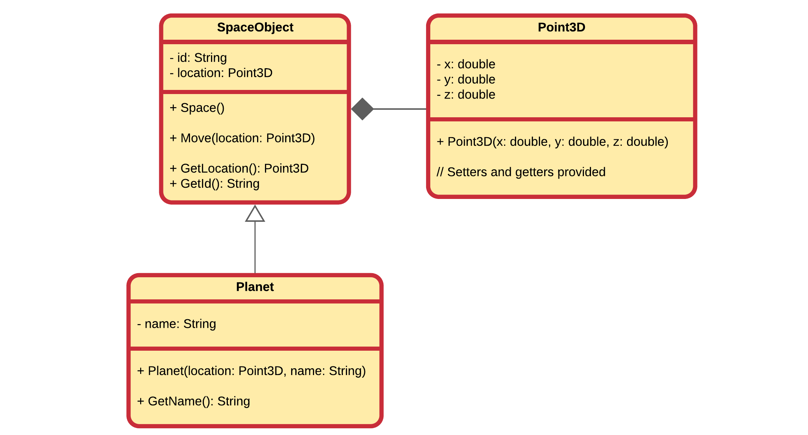
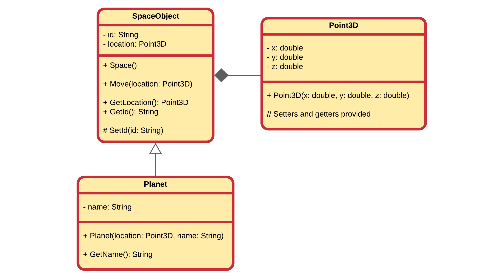

# Chapter 29 - Inheritance

Inheritance is one of the main pillars of an object-oriented programming language and provides a clean way of reusing functionality. It allows a class to inherit both the attributes and methods of another class. Common data and functionality is structured inside a base class (also called superclass) from which the more specific classes inherit (called subclasses or derived classes) properties and behavior.

::: warning Copy paste is not reuse
For all you copy-paste fanatics out there, copying code from one place to another is not considered code reuse. If the original code is ever extended, changed or corrected, chances are that you will forget to alter one of the copies.
:::

As with most in an OOP language, the solution revolves around the class. Instead of creating classes from scratch we can use existing ones and extend them or embed them within our classes. The **main advantages** of this approach is that:

* we use code that has been tested and debugged
* code is not duplicated
* classes can be kept small and thus more manageable

The trick is to use the classes without soiling the existing code. There are two ways to accomplish this and one has already been discussed in this course.

The first approach is to create and embed objects of the already existing class inside the class you are developing. This is called **composition** as the new class is composed of objects of existing classes.

The second approach is to create a new class as a subtype of an existing class. You literally take the form of an existing class and extend it, and this without modifying the code of existing class. This is called **Inheritance**.

Both approaches are important cornerstones of an object oriented programming language.

## Vehicle Example

Consider a first example that models the classes `Truck`, `Racecar` and `Bus`. Each have a number of attributes and some methods. Below is a partial UML class diagram of the classes modeled without the use of inheritance. Each class has the full functionality implemented into the class itself.


When taking a look at this example it is pretty obvious that the design includes a lot of duplication. This can be solved by creating a **superclass** (also called a **base class**) `Vehicle` that contains all the common attributes and methods of these classes.



::: tip Inheritance in UML class diagram
In a UML class diagram inheritance is depicted using a **solid line and a hollow arrow** attached at the side of the superclass.
:::

While not documented inside the UML class diagrams, the subclasses `Truck`, `Racecar` and `Bus` also contain the attributes and methods of `Vehicle`.

::: warning Private Parts
While technically subclasses also inherit the private parts, they are however not accessible from within the sub-class. More on this later.
:::

Some attributes (such as the `trailer` of a `Truck`) and methods (such as `Board(passenger)` of `Bus`) cannot be generalized to the `Vehicle` class. They are specific to the subclasses. This is perfectly valid when implementing inheritance.

By placing the common functionality and data inside a superclass a cleaner design is realized that also encourages reuse.

## Introducing Inheritance

Inheritance allows a class to inherit (get) the attributes, properties and methods of another class. In other words, the **subclass** inherits the state and behavior from the **base class**. The subclass is also called the **derived class** while the base class is also known as the **super-class**. The derived classes can add their own additional attributes and methods.

::: tip Inheritance - Extension or Generalization
Inheritance is also often described as a mechanism to **extend** the behavior and properties of the superclass. Sometimes the opposite approach is taken and common attributes and behavior is extracted from classes and place in a common base class. In this case we talk about **generalization**.
:::

It is also possible to "replace" the implementation of certain methods inherited from the base class, which is also known as **method overriding**.

::: warning Method overloading vs. method overriding
Do not confuse method overloading with method overriding. Method overloading is a feature that allows a class to have two or more methods having same name, if their argument lists are different. Constructor overloading allows a class to have more than one constructors having different argument lists. Overloaded methods are differentiated by the number and the type of the arguments passed into the method. Method overriding replaces the implementation of a method of the base class.
:::

A super-class can have any number of subclasses. While in C#, a subclass can have only one superclass, in C++ it is possible to inherit from multiple base classes, known as **multiple inheritance** (however not always a good idea or good practice).


## Computer Store Example

Let us revise the following application that is being build for an online computer web shop. A beginning developer has modeled some of the items that his client wants to sell online. However he has come to the conclusion that his design needs to be refactored.


While they are not documented in the UML, all attributes have getters and setters.

In a first iteration the most common attributes are extracted to a superclass. A good name might be `Product`. Since it is a store that sells products, it seems a logical choice. When selecting attributes from the subclasses to be placed inside `Product`, we must ask our self the question if that attribute is a logical property of computer store product. If not, then something is wrong or our models are wrong.



### Code always changes

Something to remember is that code evolves. It changes over time as things get added, removed or refactored. Static code will eventually become outdated and die. On top of that your boss, client, teacher, ... will never tell you the whole story. Once they get the first prototype, and they like it, there will always be a "would it be possible to add ..." moment. That is also why it is also more fun to program based on methodologies such as SCRUM and Agile as they take the fact of change into account.

So let us take the computer store example. Our developer needs help again as his client asked him to also add games to the list of products to sell. The overeager developer created a new class `Game` that inherits from the `Product` class. At first sight nothing seems wrong with it.


First of all it needs to be noted that adding a new product class was really easy as a lot of the functionality and properties are inherited from the `Product` base class.

Now taking a closer look at the classes, something can be noticed. Does a game have a model or a brand? In real life: no. Than why does it have a model and brand in the application?

Actually the class `Product` is not entirely accurate since games came into play. While each computer hardware product does have a model and brand, software and games do not. Basically we need to add a class `Hardware` which inherits from the `Product` class. Then our hardware products can inherit from `Hardware` and implicitly also from `Product`, while `Game` directly inherits from `Product`.


## Private, protected and public members

Attributes and methods are declared with an **access specifier** such as `private`, `protected` or `public`. These allow the developer to determine who can access the class, attributes or methods.

Very important to know is that a **derived class inherits all the members of its base class**, even the private ones. However it cannot access the **private members** (both attributes and methods) of its baseclass. For this reason getters and setters need to be provided for subclasses to have access to the attributes of their superclass.

Another solution would be to make the attributes `protected`. This would allow subclasses to access the attributes directly, while still keeping them inaccessible for outside classes. This can be a good solution in some cases, but most of the time it is cleaner to use accessors (getters and setters) - which can also be made `protected`.

Do note that you can also make methods protected, allowing subclasses to use them, but not outside classes.

Let's take another example: consider a class `SpaceObject` with a subclass `Planet`. The `SpaceObject` has both an `id` and `location` which can be accessed via getters. The `SpaceObject` can be moved using the `Move(location: Point3D)` method, but the `id` is automatically generated. The `Planet` class extends the `SpaceObject` by adding a user friendly `name `.



However with this implementation the `Planet` cannot alter the automatically generated `id`, while we which to allow to create special IDs for planets. This can be solved by adding a protected method `SetId(id: String)` and allowing subclasses to set their own `SpaceObject` IDs while still keeping the `id` "protected" from outside.



## Is-a Relationships

The superclass and subclass have an **"is-a"** relationship between them. Take the basic example of pets shown below.


Here we can for example state that a `Cat` is-a `Pet`, a `Bunny` is-a `Pet` and a `Dog` is-a `Pet`.

If you cannot logically state that 'subclass' is-a 'superclass' than you made a mistake to make 'subclass' inherit from 'superclass'. An example of this would be the case when you would create a subclass `Mosquito` from `Pet` because `Mosquito` also has `color`, `favorite food` and an `age`. This may seem DRY but it is illogical. You can't state that `Mosquito` is-a `Pet`. Chances of you giving a `Mosquito` a `name` are pretty low.

If we needed to model both a `Bus` class and a `Car` class it makes perfect sense to create a `Vehicle` class and make both `Bus` and `Car` inherit from them. It's perfectly valid to state that

* a `Bus` is a `Vehicle`
* a `Car` is a `Vehicle`

However it would of been illogical to make *Bus* inherit from *Car* or vice versa as it would not have been logical to state that:

* a Bus is a Car
* a Car is a Bus

A `ChoppingCart` should not inherit from `Vehicle` because it has wheels.

## Inheritance in CSharp

To implement inheritance in C# all you need is a baseclass and a subclass. The subclass needs to **extend** the baseclass and this can be accomplished by using the syntax shown below:

```csharp
class <subclass> : <baseclass>
  // Implementation
}
```

Note that **extending** the baseclass is exactly what we are doing when implementing inheritance. We take a general class and add something to it: data, behavior or both.

Consider the `Person` class as a baseclass example.

```csharp
public class Person
{
    public Person()
    {
        Name = "Unknown";
    }

    public Person(String name)
    {
        Name = name;
    }

    public String Email()
    {
        return Name.ToLower().Replace(' ', '.')
            + "@vives.be";
    }

    public String Name { get; set; }
}
```

Now one can inherit from this class to create a `Student` class:

```csharp
public class Student : Person
{
  public Student(String specialization)
  {
    Specialization = specialization;
  }

  public String Specialization { get; set; }
}
```

Depending on the context and strategy, inheritance can also be though of as **generalization**, where functionality of subclasses is extracted and placed inside a more generalized super class.

## Constructors and inheritance

When creating objects, C# will not only call the constructor of the type you are creating but it will implicitly call a constructor of the baseclass. Take a look at the inheritance hierarchy shown below.


When for example creating an object of type `QuadCore`, the constructor of `QuadCore` will implicitly call the constructor of `Processor` which will call the constructor of `ComputerHardware` which will call the constructor of `Product`. These calls are provided by default by C# and are done before anything else. That means that the rest of you constructor code will be executed after the contructor call to the baseclass.

This basically means that if you create an instance of a `QuadCore`, the `Product` portion will be constructed first, next the `ComputerHardware` portion, after which the `Processor` portion and last the `QuadCore` portion. This is a bit logical as you can only initialize the specific data of `ComputerHardware` after the data of `Product` has been initialized.

There is however a catch to this whole constructing system.

Remember that if you do not define a constructor in C#, it will provide you with a **default constructor** (a constructor without arguments) for a class. However once you create a constructor yourself C# will not provide this default constructor anymore. That means if you create a single constructor that takes arguments, your class will not have a default constructor anymore. Since C# will add an implicit call to the default constructor of the baseclass, it will not find one and the compiler will turn up a compiler error. In other words if no default constructor exists for the baseclass your program will fail.

This can be fixed using two approaches:

* add a default constructor to the baseclass. This is however not always possible or even advisable as you may not have access to the implementation of the baseclass or it might not make sense to add a default constructor.
* explicitly call another constructor of the baseclass. This can be achieved by using the `base` keyword in the **constructor initialization list** to call a specific constructor of the baseclass.

What approach to choose depends on the application and implementation.

An example is given the following code snippet:

```csharp
public class Student : Person
{
  public Student(String specialization)
    // Will invoke the default constructor of Person, so Person()
  {
    Specialization = specialization;
  }

  public Student(String name, String specialization)
    // name is passed to constructor Person(String name),
    // which is explicitly called using base(name)
    : base(name)
  {
    Specialization = specialization;
  }

  public String Specialization { get; set; }
}
```

So to summarize:

* C# provides a default constructor if you provide no constructor(s).
* With inheritance each constructor is called from bottom to top but actually executed from top to bottom.
* If no default constructor exists for the baseclass you will need to add one or call another constructor explicitly using the constructor initialization list and provide the required arguments.

## Method overriding

Method overriding, in object oriented programming, is a language feature that allows a subclass or child class to provide a specific implementation of a method that is already provided by one of its superclasses or parent classes. The implementation in the subclass overrides (replaces) the implementation in the superclass by providing a method that has the **same name** and the **same parameters**, and **same return type** as the method in the parent class. These three parts are all together called the **signature of a method**. An overriding method can also return a subtype of the type returned by the overridden method. This subtype is called a covariant return type.

To override a baseclass method one just needs to copy the signature of the method and indicate that the method overrides a baseclass method using the `override` keyword.

The most obvious example is the `ToString()` method we often implement in classes, which actually overrides the `Object.ToString()` method:

```csharp
public class Person
{
  public Person()
  {
    Name = "Unknown";
  }

  public Person(String name)
  {
    Name = name;
  }

  public String Email()
  {
    return Name.ToLower().Replace(' ', '.')
      + "@vives.be";
  }

  // Overriding the Object.ToString() method
  public override string ToString()
  {
    return $"{Name} <{Email()}>";
  }

  public String Name { get; set; }
}
```

::: tip Object
Object is a special class from which all other class inherit. It provides a default implementation for some methods such as `ToString()`. This strategy allow **any** object to be used where a `String` is expected. An example is `Console.WriteLine(personObject)` which automatically invokes the `ToString()` method.
:::

The ability of a subclass to override a method allows a class to inherit from a superclass whose behavior is "close enough" and then to modify behavior as needed.

Before a subclass can override a method, the baseclass does however need to indicate that the method may be overridden using the keyword `virtual` as is shown in the next example for the method `Email()` (this is both an optimization as well as a security measure.):

```csharp
public class Person
{
  public Person()
  {
    Name = "Unknown";
  }

  public Person(String name)
  {
    Name = name;
  }

  public String Email()
  {
    return Name.ToLower().Replace(' ', '.')
      + "@vives.be";
  }

  // Overriding the Object.ToString() method
  public override string ToString()
  {
    return $"{Name} <{Email()}>";
  }

  public String Name { get; set; }
}
```

Now `Student` can override the `Email` method:

```csharp
public class Student : Person
{
  public Student(String specialization)
  {
    Specialization = specialization;
  }

  public Student(String name, String specialization)
      : base(name)
  {
    Specialization = specialization;
  }

  public override String Email()
  {
    return base.Email().Replace("vives", "student.vives");
  }

  public String Specialization { get; set; }
}
```

Note that you can call methods of the base class by using the `base` keyword followed a `.` and the name of the method you wish to call. This can be useful if you do not want to replace the implementation of the baseclass but rather want to extend it.

The rules for method overriding can be summarized as follows:

* The argument list should be exactly the same as that of the overridden method.
* The return type should be the same or a subtype of the return type declared in the original overridden method in the super class.
* The access level cannot be more restrictive than the overridden method's access level. For example: if the super class method is declared `protected` then the overriding method in the sub class should also be `protected` or even `public`. It cannot be declared as `private`.
* A subclass can only override methods declared `public` or `protected`.
* The base class needs to declare the method to be overridable by making it `virtual`.
* The sub class needs to indicate it overrides a method of a base class by using the keyword `override`.
* Constructors cannot be overridden.

The version of a method that is executed will be determined by the object that is used to invoke it. If an object of a parent class is used to invoke the method, then the version in the parent class will be executed, but if an object of the subclass is used to invoke the method, then the version in the child class will be executed. The actual type of the object itself is tracked by C#.

```csharp
Student rick = new Student("Ricky Rolly", "Electronics / ICT");
Console.WriteLine(rick);

Person piere = new Person("Piere Makkers");
Console.WriteLine(piere);

Person thomas = new Student("Thomas Ferenzy", "Electronics");
Console.WriteLine(thomas);
```

::: codeoutput
```
Ricky Rolly &lt;ricky.rolly@student.vives.be&gt;
Piere Makkers &lt;piere.makkers@vives.be&gt;
Thomas Ferenzy &lt;thomas.ferenzy@student.vives.be&gt;
```
:::

So in the previous example, the `Student` object `thomas` is stored in a variable of type `Person`, but at object level, C# still knows that this object is actually an object of type `Student`.
