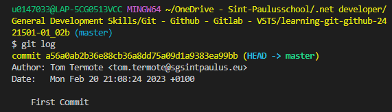
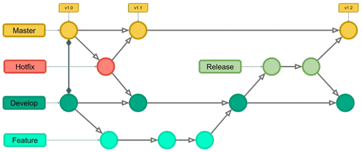

# Basics of Git and GitHub

> 🌐 Supporting learning material
>
> LinkedIn Learning course: [Learning Git and GitHub](https://www.linkedin.com/learning/learning-git-and-github-14213624/travel-the-multiverse-with-git-and-github)
>
> Cheatsheet: [Cheatsheet GIT](/files/github-git-cheat-sheet.pdf)

In the software world we will be using Git & GitHub as a **version control management system** that enables us to have **versions** of our sofware, keep **track of the changes** that where made and make branches to **safely develop** new content without the risk of messing up the live version.

Here is some terminology we will be using:

| **Term** | **Meaning** |
|------|------|
|  Repository    |    You can think of a repository as the main folder of your project. This contains all the files in your project and the history of changes you have made.  |
|  Branch    |  Separate place within your repository, where you can, for example, test new code, without having to do so on the “product version”.    |
|  Master/main    |  This is the main branch, or the “product version” of your project. New code that has been tested and approved is merged into the Master branch.    |
|  Fork    | A fork is a copy of a repository. This allows you to work on someone else's project without modifying the original.     |
|  Commit    | Git command that adds changes to your local repository.     |
|  Push    |  Git command to send changes to your (remote) repository, which is on GitHub.   |
|  Pull    |   Git command to send changes from your (remote) repository to your local files.   |
|  Merge    |  Git command to merge changes from one branch to another branch. For example, merging changes that have been tested and approved in the “Develop” branch with the “Master” branch.    |
|  Checkout    |  This Git command is often used to switch between branches. You check out of one branch, as it were, and start working in another branch.   |

## Git

### Starting a new project

1. Create a folder for the project (you can name it whatever you want, but it's adviced to choose a meaningfull name).
2. Now you need a terminal in that folder. You can either open that folder with Visual Code and then open a terminal or you can open a powershell from that folder.
3. Now enter the command `git init` to start the version control with Git.

### Staging files

To create an entry that we can return to we need to add the files to a temporary space where we can store files that we can commit later. This temporary space is called the staging environment.

This can be done by the commands `git add -all`, `git add -A` or `git add .`. I prefer to use the last one.

### Commit files

Create a new commit containing the current contents of the index and the given log message describing the changes. A checkpoint is made that makes it possible to return to this point.

This is done by the command `git commit -m "text that explanes the changes"`

If you want to have a look at the commit information you can use the command `git log`.



You can see the unique ID (hash) for the current commit and the branch (master) you are committing to.

### Environments & File states

In Git we have the following environments:
* **Working environment**: Files here look as they did during the last commit
* **Staging environment**: Temporary environment where you can queue changes until you are ready to create a new commit.
* **Commit environment**: A new entry is created with a new hash. 

Files can have the following states:

* **Tracked**
    
    Files that already existed in the previous commit
    * Unmodified: unchanged
    * Modified: changed
    * Staged: Sitting in the staging environment
* **Untracked**
    
    Everything else (a new file added since the last commit)

### Ignoring files

Not all files should be included in the Git management, such as sensitive or personal information:
* API keys
* Authentication tokens
* To Do items
* System files

You can do this by adding a `.gitignore` file and adding the folders and files that should be excluded from the git tracking.

### Looking for differences

* `git diff`: To show the differences between the working copy and the HEAD commit (latest commit in the current branch)
* `git diff --staged`: To show the differences between the staging area and the HEAD commit

### Branches

Normaly you are working on the `Master` or `Main` branch, let's call this the production of live branch.
If you want to make changes without risk of breaking the live branch it's a good idea to make a new branch for this.
Usually this branch is called `dev` as in development branch, but other branches like `hotfix` are also possible.
Once the development is done and fully tested you can merge it with the production branch.

The **git flow** below is therefore often used.

For example, you want to add a new feature or perform a patch or fix:

* You create a new branch with an appropriate name
* You make the necessary adjustments and test everything
* You merge that branch with the master branch
* You delete the used branch.

In all this you never work directly on the master branch.



* `git branch`: Shows all branches
* `git switch -c "new-branch"`: Changes to a new branch called "new-branch"
* `git switch master`: Switch to a existing branch (in this case the master branch)
* `git merge new-branch`: Merge the current branch with the "new-branch" branch
* `git branch -d new-branch`: Delete the branch called "new-branch"
  

## GitHub

GitHub is an online platform for software development and version control that is built around the Git version control system, providing all the features of Git for managing versions and source code.
It is a social coding website with a storage service in the cloud that offers the possiblity to share code and even collaborate on software development.

### Link Git to your GitHub repository

When logged in into GitHub you can see all your repositories. With the `New` button you can make a new repository (public or private).
Once that is done you can add this repository as your remote to your git local development folder:

```bash
git remote add origin URL
```

Where the url is url of your GitHub repository (you can find this under the button `Code` of your repository in the tab `HTTPS`)

### Push changes to the remote 

Once changes have been committed they can be pushed to your GitHub repository with `git push --u origin master`

### Cloning a repository

You can make infinite local copies of a repository.

Just open a terminal in the folder where you want to add the local copy and type `git clone URL foldername`. 
Where URL is the URL of the GitHub repository and foldername is the name you want to give to the local folder.

:::warning ❗Warning
When working with different local copy's (maybe these are local copies of different teammembers) always merge the remote with the local version before changing and pushing again.
:::

* `git fetch`: only retrieves the latest commit history from the remote repository, but it does not affect the local copy.
* `git pull origin master`: merges the master branch on the remote with the local copy.


