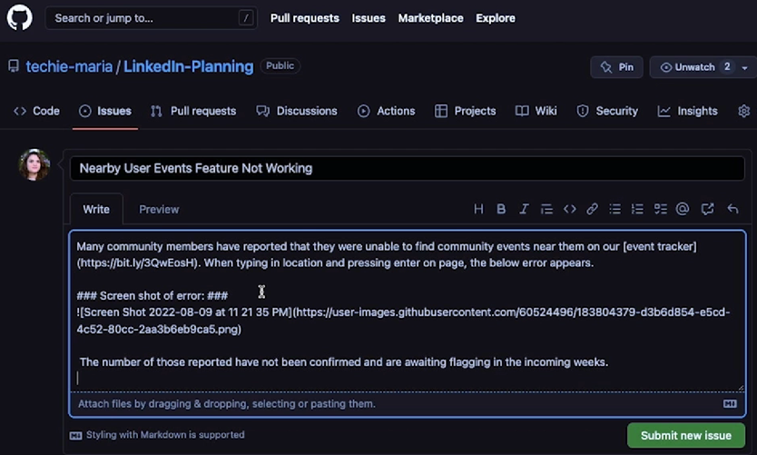

# GitHub Teamwork

The whole idea of ​​GitHub is to be able to develop software together.

## Issues

An Issue is a ticket or tracking tool for teams to communicate about an idea, work and/or bugs.

**Issue etiquette**
* One issue created per issue in the project
* Titles are descriptive and straight to the point
* Provide evidence like screenshots, video's and errorcodes
* Identify steps to recreate the problem



### Tasklists

To provide a tracking tool for the initiator of the issue one can create a tasklist for the issue.

Simply edit the issue and create the tasklist in markdown.

```markdown
* [] Fix bug in code
* [] Test code
* [] Push code
```

Which results in:


This makes it easier to track the progress for this issue:


### Assignees

It can become difficult in big projects to remember who is responsible for which issue and which issues you are responsible for. 
Assignees allow you to assign team members to an issue. This helps them track the progress on the issue and helps everyone remember their tasks within the project.


### Labels

Labels give a form of organization for issues.

 Standard labels:
 * Bug
 * Documentation
 * Duplicate
 * Enchancement
 * Help wanted
 * ...

You can have mulitple labels per issue


### Templates

Issue templates allow you to set up one/multiple templates which will guide the creation of issues.

Go to your repository > settings > general > features > set up templates

## Managing issues

### Marking duplicates

To mark an issue or pull request as a duplicate, type "Duplicate of" followed by an issue or pull request number in the body of a new comment.


### Closing an issue

If an issue is fixed, acted on or is no longer an issue you can close the issue as followed:
* Go to the issue in your repository
* Click `Close issue` and if needed click the arrow to select a reason for closing the issue.

### List of issues

You can view all the issues that you created, that are assigned to you or in which you are mentioned on the issues tab on your home page.


